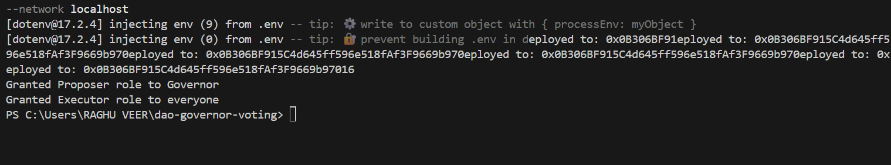
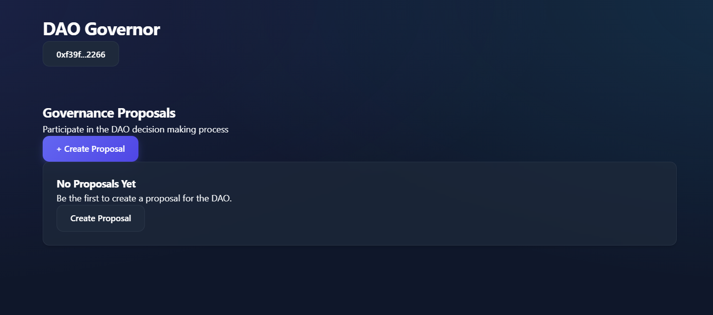
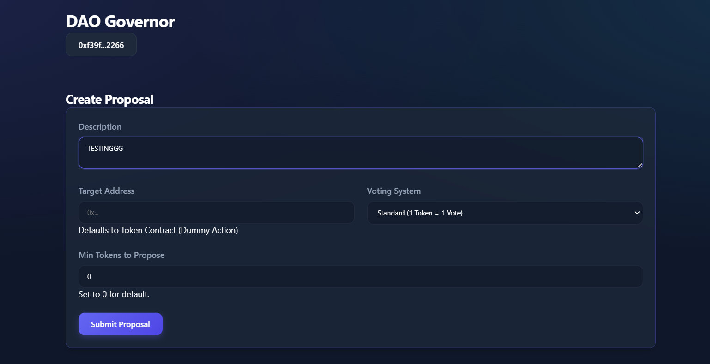
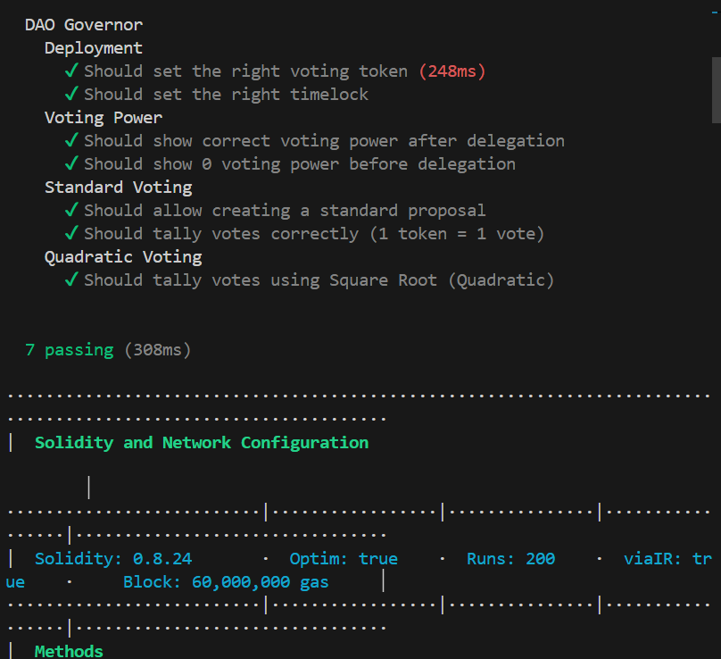

# DAO Governor Voting Platform

This project implements a decentralized voting system using OpenZeppelin's Governor contracts on Ethereum (or EVM-compatible chains). It features a full-stack DApp with:

-   **Smart Contracts**: ERC-20 Governance Token, Timelock Controller, and a Modular Governor with support for Standard (1 Token = 1 Vote) and Quadratic Voting.
-   **Frontend**: Next.js application for proposal creation, delegation, and voting.
-   **Containerization**: Dockerized setup for local development.

## Project Structure

-   `/contracts`: Smart contracts (Solidity).
-   `/scripts`: Deployment and helper scripts.
-   `/test`: Test suite.
-   `/frontend`: Next.js frontend application.
-   `hardhat.config.js`: Hardhat configuration.
-   `docker-compose.yml`: Docker services definition.

## Getting Started

### Prerequisites

-   Node.js (v18+)
-   Docker & Docker Compose

### Local Development

1.  **Install Dependencies** (Root):
    ```bash
    npm install
    ```

2.  **Compile Contracts**:
    ```bash
    npx hardhat compile
    ```

3.  **Run Tests**:
    ```bash
    npx hardhat test
    ```

4.  **Start Local Node & Frontend (Docker)**:
    ```bash
    docker-compose up --build
    ```
    This will start a Hardhat node on port 8545 and the frontend on port 3000.

    **Note**: You may need to deploy contracts manually to the local node or use a deployment script within the container entrypoint if configured.
    Currently, run:
    ```bash
    npx hardhat run scripts/deploy.js --network localhost
    ```
    (Ensure the node is running first).

## Features

-   **Governance Token**: ERC-20 token with voting capabilities (`ERC20Votes`).
-   **Timelock**: Delays execution of passed proposals for security.
-   **Governor**: Manages proposal lifecycle.
    -   **Standard Voting**: Traditional 1 vote per token.
    -   **Quadratic Voting**: Vote weight is the square root of token balance (simulated via custom counting logic).
-   **Frontend**:
    -   Connect Wallet (MetaMask, etc.)
    -   Delegate Votes
    -   Create Proposals (Standard or Quadratic)
    -   View Proposals and Vote

## Configuration

-   Update `.env` with your `PRIVATE_KEY` and `SEPOLIA_RPC_URL` for testnet deployment.
-   Adjust Governor parameters (Voting Delay, Period, Quorum) in `scripts/deploy.js` or `contracts/MyGovernor.sol`.

## License

MIT

## Screenshots

### 1. Deployment Output

*Successful deployment of Governor, Token, and Timelock contracts to local Hardhat network.*

### 2. Dashboard (Empty State)

*Initial view of the DApp dashboard before any proposals are created.*

### 3. Creating a Proposal

*Proposal creation form with description and voting system selection.*

### 4. Test Verification

*Comprehensive test suite passing all checks for smart contracts and voting logic.*
